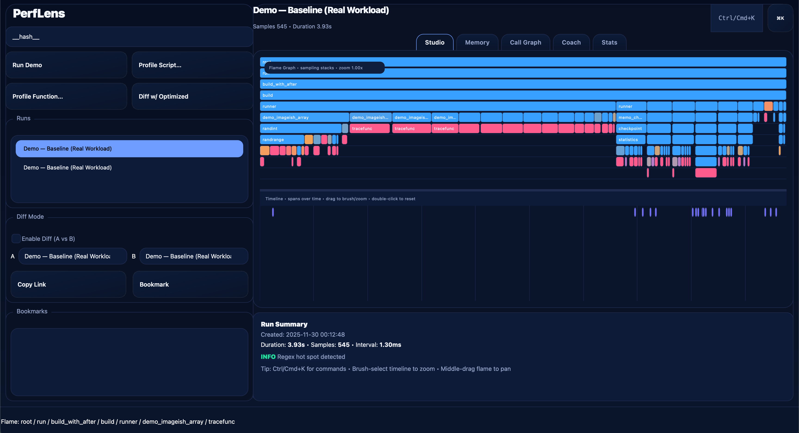

# PerfLens

PerfLens is a single-file visual performance studio for Python that turns cProfile, tracemalloc, and stack sampling into interactive insights. Launch it to explore a zero-input demo session, then point it at your own scripts to get flame graphs, timeline traces, memory heatmaps, and call graphs in seconds.



## Highlights
- **Stack sampling flame graphs** to spot the hottest call paths.
- **Timeline trace** with zoom/brush to correlate CPU and memory activity over time.
- **Tracemalloc-powered memory heatmap** and allocation diffs.
- **Hot-path call graph** for quick visual navigation.
- **Diff Mode** to compare two runs side-by-side (CPU flame + memory diffs + moved hotspots).
- **Optimization Coach** with actionable heuristics (e.g., N+1 queries, redundant JSON parsing, heavy allocations, sequential awaits).
- **Polished UX:** command palette (Ctrl/Cmd+K), global search, bookmarks, shareable `perflens://` links, dark/light theme, glossary tooltips.
- **Session save/load** to deterministic JSON and **exportable HTML reports** for sharing.

## Requirements
- Python 3.10+
- [PySide6](https://pypi.org/project/PySide6/) for the desktop UI

Install dependencies:

```bash
pip install PySide6
```

## Run PerfLens
Start the app directly from the repository root:

```bash
python main.py
```

On launch, PerfLens opens a realistic demo session (JSON parsing, image-like array work, async I/O, sqlite) so you can explore the UI immediately. The interface remains responsive thanks to background worker threads, cancellation, throttled rendering, and bounded caches.

## Profile your own code
1. Open **Profile Script…** to run a Python file with profiling enabled, or **Profile Function…** to wrap a callable.
2. Interact with the flame graph, trace, memory heatmap, and call graph to investigate hotspots.
3. Save the session as JSON or export an HTML report to share findings.

## Diff and coach workflows
- Use **Diff Mode** to load two runs and visualize CPU and memory deltas with clear "moved hotspot" highlights.
- Enable **Deep Trace (sys.setprofile)** when you need call-level detail beyond sampling.
- Open **Optimization Coach** for explainable suggestions; each tip links directly to the relevant region in the visuals.

## Tips
- Switch themes from the UI to match your preference (dark/light).
- Use the command palette for fast navigation, filtering, and shortcuts.
- Tooltips include glossary entries for profiling metrics if you need a quick refresher.

## License
Apache-2.0 License. See [LICENSE](LICENSE) for details.
